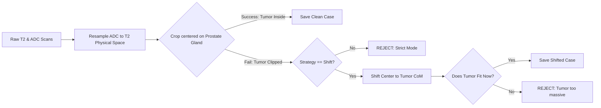

# CS7642 Prostate Cancer Detection (PI-CAI)

This repository contains a custom, state-of-the-art Deep Learning pipeline for clinically significant Prostate Cancer (csPCa) segmentation. It leverages multiparametric MRI (T2W and ADC) and features a custom Dual-Encoder 2.5D U-Net with Cross-Attention mechanisms.

## 1. Project Structure
```text
.
├── config/
│   ├── dataset.yaml            # Master configuration for data & pipeline
│   └── default.yaml
├── models/
│   ├── blocks.py               # Custom NN modules (CrossAttention, DoubleConv)
│   ├── unet2_5d.py             # Master architecture
│   └── weights/                # Saved .pth weights and CSV logs
├── scripts/
│   ├── analyze_runs.py         # Automated evaluation & metric plotting
│   ├── generate_splits.py      # Train/Val/Test manifest generator
│   ├── preprocess_dataset.py   # CoM Centering and spatial resampling
│   └── preprocess_negatives.py # Healthy patient extraction
├── trainer/
│   ├── dataset.py              # PyTorch 2.5D DataLoader with Z-Score normalization
│   ├── losses.py               # Combined Focal + Dice Loss for severe imbalance
│   └── train.py                # AMP-optimized training loop with Early Stopping
└── utils/
    ├── loader.py               # Robust percentile normalization and ITK resampling
    └── viewer.py
```

---

## 2. Getting Started
1. Clone the repository locally.
2. Create a virtual environment: `python -m venv .venv`
3. Activate the environment:
   * **Mac/Linux:** `source .venv/bin/activate` 
   * **Windows:** `venv\Scripts\activate`
4. Install dependencies: `pip install -r requirements.txt`
5. Install the project locally: `pip install -e .`

---

## 3. Configuration (`config/dataset.yaml`)
All hyperparameters for data preprocessing and ML splitting are centralized in `config/dataset.yaml`. Adjust the `strategy` and `balancing` modes here before running the pipeline.

```yaml
dataset:
  crop_size: 128
  strategy: "strict"  # Options: "strict", "shift"

balancing:
  mode: "auto_balance" # Options: "auto_balance", "clinical_override"
  clinical_negative_cases: [] 

splits:
  train_ratio: 0.70
  val_ratio: 0.15
  test_ratio: 0.15
  random_seed: 42
```

---

## 4. Preprocessing Pipeline (`scripts/preprocess_dataset.py`)
To solve the spatial variance in MRI scans, we center the prostate and extract normalized physical tensors across T2 and ADC modalities.

### Key Design Decisions:
* **Anatomical Centering:** We use the AI-generated Whole Gland mask (**Bosma22b**) to calculate the Center of Mass (CoM). This ensures the crop is centered on the organ, not just the tumor, providing consistent anatomical context.
* **Dynamic Resolution:** Controlled via `crop_size` in the YAML (Default 128x128). At ~0.5mm/pixel, a 128 crop safely encapsulates the average prostate (~40-50mm) plus a healthy margin.
* **Registration:** ADC images (lower resolution) are resampled into the T2 reference space before cropping to ensure 1:1 pixel alignment for the Cross-Attention bottleneck.

### Crop Strategies:
We provide two modes to facilitate ablation studies on spatial alignment:
1.  **Strict (Default):** Rejects any patient where the bounding box clips the tumor. 
    * *Use case:* When absolute anatomical centering is required.
2.  **Shift:** If a tumor is clipped, the script recalculates the CoM based on the tumor and shifts the box.
    * *Use case:* Maximizing training data and testing robustness to off-center anatomy.



**To run the extractor and generate the PyTorch splits:**
```bash
python scripts/preprocess_dataset.py
python scripts/generate_splits.py
```

---

## 5. Model Architecture & Training
This project utilizes a custom **2.5D Dual-Encoder U-Net**. 
Instead of concatenating T2 and ADC scans blindly at the input, the network uses two separate encoder branches to extract modality-specific features. These features are then fused at the bottleneck using a `CrossAttentionBlock`, allowing the network to dynamically weigh T2 spatial resolution against ADC cellular density.

### Hardware Optimization (AMP)
The training engine (`trainer/train.py`) is fully optimized for modern GPUs using **Automatic Mixed Precision (AMP)** via `torch.amp.autocast`. 
* **FP16 Stability:** Attention energy matrices are explicitly shielded from PyTorch's native `.autocast` using a nested float32 context to prevent dot-product saturation and `NaN` gradient explosions.
* **Loss Function:** We utilize a custom `CombinedFocalDiceLoss`. Focal Loss forces gradient updates on hard-to-predict tumor pixels, while Dice Loss guarantees morphological spatial overlap, entirely ignoring the massive class imbalance of the healthy background.

**To execute a training run:**
```bash
# Example: Training with learning rate 1e-3
python trainer/train.py --lr 1e-3 --batch_size 64
```

---

## 6. Evaluation & Visualization
Instead of manual evaluations, use the automated analysis script. It aggregates all trained weights, pairs them with their CSV logs, computes the global **Dice Similarity Coefficient** and **Sensitivity (Recall)**, and plots both the learning curves and a 3-panel visual prediction.

**To analyze all runs on the Test set:**
```bash
python scripts/analyze_runs.py --split test
```
*(Outputs structured folders with metrics and PNGs to the `results/` directory)*

---

## 7. Future Work
* **N4ITK Bias Field Correction:** To flatten low-frequency magnetic field inhomogeneities across different MRI scanner vendors.
* **Elastic Deformations & Augmentations:** Introduce physical warping, affine translations, and Gaussian noise to the `PICAI25DDataset` to aggressively combat spatial memorization and improve generalizability.
* **Spatial Dropout:** Implement `nn.Dropout2d` to drop entire feature channels, preventing channel co-adaptation between the T2 and ADC encoders.
* MLFlow, Optuna, incorporating all the hyperparameters including strategies and data-level hyperparameters.